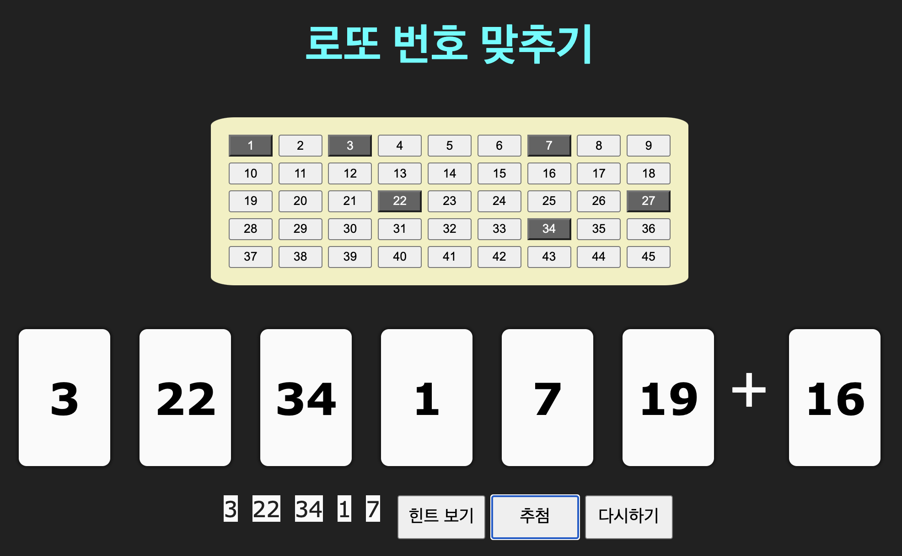

# 매주 꼬마 앱 만들기

## 로또 번호 맞추기 게임

- [힌트가 있는 버전 해보기](https://lazychoi.github.io/toyapps/01_lotte_numbers/lottery_game.html)
- [힌트 없는 버전 해보기](https://lazychoi.github.io/toyapps/01_lotte_numbers/real_lottery_game.html)
- [로또번호 맞추기 앱을 만들며 배운 것](https://github.com/lazychoi/toyapps/wiki)

## 수식 계산기 - 괄호 포함한 사칙연산

